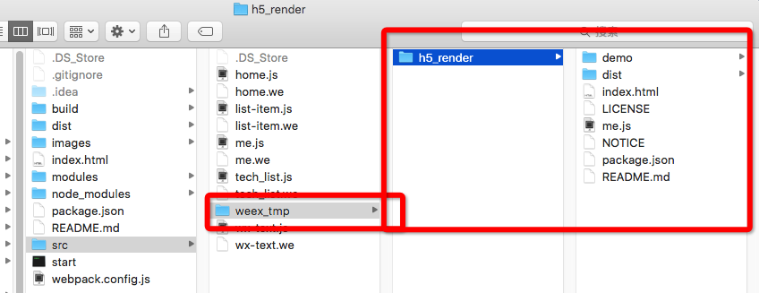

title: HellowWeex
categories:
- WEEX
date: 2016/9/13 20:46:25
---

             
## Weex是什么？
Weex是阿里开源的一套构建跨平台的移动框架。对于前端，最直观的是web components的开发方式；对于Native同学，可以理解为使用web的开发方式构建跨平台移动程序（iOS & Android）。可以类比的是React Native，但是相对React Native更为彻底：不仅统一了 iOS/Android的差异，更是实现了三端的统一。2016年，weex值得去关注，因为目前移动端的痛点是需要被攻克的难题。而这一块也是大家孜孜不倦的努力探索的结果。           
Weex更多细节参考： http://alibaba.github.io/weex/index.html。    

## Hello world    
现在的开发方式，不像以前直接1个html文件就可以的。任何工程化的体系都有相配套的工具。

### 第0步：安装Node.js    
如何安装，这里不赘述了，可以直接到Node.js官网下载安装。安装Node.js的同时会帮助我们安装好npm。 初步安装的同学可以使用:  

```bash   
$ node -v
v6.3.1
$ npm -v
3.10.3
```	
node -v 和 npm -v 命令来测试Node.js环境是否搭建成功。	
### 第1步：安装weex-toolkit      
这里使用npm来完成。因为npm之前已经安装好了。所以，直接拿来使用即可。      

```bash
$ npm install -g weex-toolkit    
```	  
	
如果发现很慢，说明是时候考虑使用cnpm来安装了。首先，我们全局安装cnpm：     

```bash
$ npm install -g cnpm 	       
```
		
cnpm是一个国内npm镜像，可以提高下载速度。我们使用cnpm：     

```bash
$ cnpm install -g weex-toolkit      
``` 

**备注：** 若提示权限问题，加上``sudo``关键字即可(管理员权限，和Win下右键以管理员身份运行一样)。例如：  
 
```bash 
$ sudo npm install -g weex-toolkit 	   
```

 然后输入你本机电脑密码即可。       
 
 weex-toolkit安装完成后，输入:
 
```bash 	
 $ weex --version    
 info 0.4.4 
```
             
说明，我们安装成功。               

<!--more-->
### 第2步：创建文件     
weex程序的文件后缀（扩展名）是.we。因此我们创建一个.we的文件。Linux下可以使用touch命令创建文件。      

```bash	
$ touch hello.we       
```

我们打开空白的hello.we文件，输入三个标签，内容为：       
 
```html
<template></template>
<style></style>
<script></script>      
```	
	
其实，这个时候，我们的程序完成了，就是这么简单粗暴。开发完成了，这段代码是不能直接跑的。我们都知道.html是可以直接运行的，这个程序呢，缺少了html的载体，同时只是xml的子集。那么，我们就需要使用weex-toolkit来编译我们的代码了。这里，使用weex命令编译hello.we文件。              

```bash
$ weex hello.we       
```	
	 
这时，会发现浏览器被打开了，浏览器地址是：        

``http://127.0.0.1:8081/weex_tmp/h5_render/?hot-reload_controller&page=hello.js&loader=xhr``          

这是浏览器是空白的，因为我们没有添加任何实质的内容。          

### 第3步：添加内容     
我们修改weex.we文件，像 hello.we 的 template 添加内容。 weex.we文件内容如下：        

```html
<template>
  <div>
	<text>Hello world</text>
  </div>
</template>
<style></style>
<script></script>       
```	
	 
我们再次编译hello.we文件：    

```bash
$ weex hello.we       
```	

OK，我们会看到浏览器显示了：Hello world字样。        

### 第5步：增加样式       
 我们给text增加样式，具体代码如下：           

```html 
<template>
	<div>
		<text class="text" style="color:red;">Hello world</text>
	</div>
</template>
<style>
	.text{
		font-size:160;
	}
</style>
<script></script>     
```
	
weex-toolkit ** 会帮我们重载页面 **（前提是在文档修改完成的时候保存一下就可以了）。浏览器可以看到“Hello world”字样。
 
 


weex中支持``style``和``class``来设定样式。但是font-size：160后面没有px。因此，css需要统一web和Native。weex做了兼容和取舍，目前支持的样式如下： http://alibaba.github.io/weex/doc/references/common-style.html     


### 第6步：.html文件载体在哪    
我们既然运行了程序，那么一定有一个.html作为程序入口。其实，weex-toolkit给我们生成了相关文件。我们可以到hello.we同级目录下查找，就会发现有一个weex_tmp文件。该文件夹就是生成的可以执行的浏览器代码。       



### 第7步：实践 

和web不同的是div**不可以**直接在里面写字，因为text组件是用来渲染文本的。在weex或者react native中，类似的这些标签不再是html元素了，而是组件。组件的意思是，每个组件承载各自的功能，区分明显；不像web那样自由。 


其它组件有哪些？哪些组件可以使用？ 
参考： http://alibaba.github.io/weex/doc/ 

